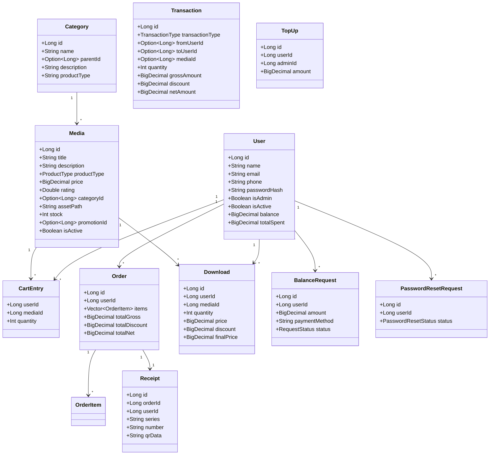

# Documentación del Proyecto E-Commerce en Scala

## 1. Descripción General

Este proyecto es un sistema de comercio electrónico implementado desde cero en **Scala 2.13**, sin frameworks web (no Play, no Spring, etc.).  
El servidor HTTP está construido manualmente sobre `java.net.ServerSocket` y la persistencia se realiza en **MongoDB**.

El proyecto soporta:
- Productos digitales (audio, video, diseño) y hardware.
- Carrito de compras, pedidos, transacciones y boletas (HTML + PDF).
- Recargas de saldo, sistema de notificaciones, regalos, ratings y rankings.
- Panel de administración completo.
- Envío de boletas por **correo electrónico** usando SMTP real.

---

## 2. Arquitectura del Proyecto

### 2.1. Estructura de carpetas

```text
lp-ecommerce/
├── app/
│   ├── controllers/        # Lógica HTTP (controladores)
│   ├── db/                 # Conexión y migraciones MongoDB
│   ├── http/               # Servidor HTTP manual
│   ├── models/             # Modelos de dominio + repositorios
│   ├── scripts/            # Scripts de organización de datos
│   ├── services/           # Servicios de negocio (Main, receipts, email, analytics)
│   ├── session/            # Manejo de sesiones y CSRF
│   └── views/              # Plantillas HTML
├── public/
│   ├── images/             # Imágenes, assets de audio/video (vía /assets)
│   ├── javascripts/        # JS para frontend (addContent, carrito, etc.)
│   ├── stylesheets/        # CSS
│   └── receipts/           # Boletas HTML/PDF generadas
├── project/                # Configuración SBT
└── build.sbt               # Dependencias y configuración de compilación
```

### 2.2. Componentes principales

- `http/HttpServer.scala`  
  Servidor HTTP de bajo nivel (abre el puerto 9000, acepta sockets, parsea requests y escribe responses).

- `http/Router.scala`  
  Centraliza todas las rutas y mapea `(método, path)` → controlador/método.

- `db/MongoConnection.scala`  
  Administra la conexión a MongoDB, colecciones y datos de ejemplo/migraciones.

- `models/*.scala`  
  Modelos de dominio + repositorios:
  - `User`, `UserRepo`
  - `Media`, `MediaRepo`
  - `Category`, `CategoryRepo`
  - `Promotion`, `PromotionRepo`
  - `CartEntry`, `CartRepo`
  - `Order`, `OrderRepo`
  - `Transaction`, `TransactionRepo`
  - `Download`, `DownloadRepo`
  - `Notification`, `NotificationRepo`
  - `BalanceRequest`, `BalanceRequestRepo`
  - `TopUp`, `TopUpRepo`
  - `Receipt`, `ReceiptRepo`
  - `PasswordResetRequest`, `PasswordResetRequestRepo`

- `controllers/*.scala`  
  Controladores responsables de manejar rutas y componer vistas:
  - `AuthController`: login, registro, protección de rutas.
  - `HomeController`: página principal.
  - `ShopController`: catálogo, detalle de producto, carrito, compra.
  - `UserController`: cuenta, descargas, pedidos, info usuario, cambio de contraseña.
  - `AdminController`: dashboard admin, productos, categorías, promociones, estadísticas.
  - `GiftController`, `RatingController`, `ReceiptController`, `RankingController`.

- `services/Main.scala`  
  Punto de entrada del sistema (`main` que corre con `sbt run`).

- `services/ReceiptService.scala`  
  Genera boletas HTML y PDF, y coordina almacenamiento en `public/receipts`.

- `services/EmailService.scala`  
  Envía correos (boletas) vía SMTP real (Jakarta Mail) o modo demo (consola).

- `session/*`  
  Gestión de sesión con cookies y protección CSRF.

---

## 3. Diagrama de Clases (vista simplificada)

Diagrama textual (puedes pegarlo en un editor que soporte Mermaid):



---

## 4. Flujos principales

### 4.1. Inicio del servidor (`services.Main`)

1. Muestra banner informativo.
2. Verifica conexión a MongoDB (`MongoConnection.testConnection()`).
3. Inicializa datos de ejemplo y migra categorías/productos si corresponde (`initializeData`).
4. Opcionalmente purga solicitudes de recarga antiguas (`LP_PURGE_BALANCE_REQUESTS`).
5. Levanta `HttpServer` en puerto 9000 y configura shutdown limpio.

### 4.2. Flujo de registro y login

- **Registro (`AuthController.register`)**
  - Recibe `name`, `email`, `phone`, `password` del formulario.
  - Usa `UserRepo.add` (hashea contraseña con SHA-256 + Base64).
  - Redirige a login.

- **Login (`AuthController.login`)**
  - Valida credenciales con `UserRepo.authenticate`.
  - Crea sesión y cookie `sessionId`.
  - Redirige a `/user/account` (si usuario) o `/admin` (si admin).

- **Protección de rutas**  
  - `AuthController.requireAuth` y `requireAdmin` se usan en todos los controladores para proteger rutas.
  - Si no hay sesión válida, redirige a login.

### 4.3. Flujo de compra

1. Usuario agrega productos al carrito (`ShopController.addToCart`, `CartRepo`).
2. Visualiza carrito (`ShopController.viewCart`):
   - Muestra stock, tipo de producto, precio y saldo disponible.
3. Inicia compra (`ShopController.purchasePage`):
   - Verifica que el carrito no esté vacío.
4. Procesa compra (`ShopController.processPurchase`):
   - Calcula precios con promoción y descuento VIP (`calculatePricing`).
   - Verifica que no haya productos sin stock (solo hardware usa stock).
   - Descuenta saldo (`UserRepo.deductBalance`).
   - Reduce stock de productos hardware (`MediaRepo.reduceStock`).
   - Crea `Order` y `OrderItem`s (`OrderRepo.create`).
   - Registra transacciones (`TransactionRepo.create`) y descargas digitales (`DownloadRepo.add`).
   - Genera boleta (`ReceiptService.ensureReceiptFor`), que también dispara el correo.
   - Limpia carrito (`CartRepo.clear`).

### 4.4. Recargas de saldo

- Usuario solicita recarga (`UserController.balanceRequestForm` → `BalanceRequestRepo.add`).
- Admin ve solicitudes (`AdminController.balanceRequests`, vista `admin_balance_requests.html`).
- Al aprobar (`BalanceRequestRepo.approve`):
  - Suma saldo (`UserRepo.addBalance`).
  - Crea `TopUp` en `topups`.
  - Crea notificación `BalanceApproved`.
- Al rechazar (`BalanceRequestRepo.reject`):
  - Marca la solicitud como `rejected` y notifica al usuario.

### 4.5. Cambio de contraseña

**Forma 1 – Usuario dentro de sesión:**  
`/user/password` → `UserController.changePassword`

- Valida nueva contraseña (`min length 6` y confirmación).
- Si **NO** hay solicitud aprobada de reset:
  - Requiere contraseña actual y valida con `UserRepo.changePassword`.
- Si **SÍ** hay `PasswordResetRequest` en estado `Approved`:
  - Ignora la contraseña actual.
  - Cambia directamente la contraseña con `UserRepo.forceChangePassword`.
  - Marca la solicitud como `Completed`.

**Forma 2 – Solicitud al admin (dentro de sesión):**  
`POST /user/password/request` → `UserController.requestPasswordChange`

- Usuario envía una solicitud con notas opcionales.
- Se crea un `PasswordResetRequest` en estado `Pending`.
- Se notifica al usuario y a todos los admins.
- El admin gestiona solicitudes en `/admin/password-requests`:
  - **Aprobar** (`AdminController.approvePasswordReset`): `status = Approved` + notificación al usuario.
  - **Rechazar** (`AdminController.rejectPasswordReset`): `status = Rejected` + notificación al usuario.

**Forma 3 – Olvidé mi contraseña (fuera de sesión, por correo):**  

- `GET /forgot-password` → formulario donde el usuario ingresa su email.
- `POST /forgot-password`:
  - Busca usuario por email.
  - Si existe, genera un código de 6 dígitos (`PasswordResetCodeRepo.createForUser`) válido por unos minutos (configurable).
  - Envía el código al correo del usuario usando `EmailService.send`.
  - Redirige a `/reset-password`.
- `GET /reset-password` → formulario donde se ingresa:
  - correo,
  - código de 6 dígitos,
  - nueva contraseña + confirmación.
- `POST /reset-password`:
  - Verifica que el código sea válido y no expirado (`PasswordResetCodeRepo.findValid`).
  - Si es válido, actualiza la contraseña con `UserRepo.forceChangePassword` y marca el código como usado.
  - Si no, muestra error (“Código inválido o expirado”).

### 4.6. Boletas y correos

1. `ReceiptService.ensureReceiptFor(order)`:
   - Busca boleta previa (`ReceiptRepo.findByOrder`).
   - Si no existe, crea una nueva (`ReceiptRepo.create`).
   - Genera QR, HTML y PDF en `public/receipts/`.
   - Actualiza rutas almacenadas en MongoDB.
   - **Si es la primera vez** (orden nueva): envía correo al usuario con el PDF adjunto (via `EmailService.send`).

2. El usuario puede luego:
   - Descargar el PDF desde “Mis compras” (`ReceiptController.download`).
   - Ver boleta en línea (HTML público).

---

## 5. Módulos y funciones importantes

### 5.1. `Media.scala` (productos)

- `case class Media(...)`  
  Representa un producto (digital o hardware).

- Métodos clave:
  - `def managesStock`: `true` solo para hardware.
  - `def hasStock(quantity: Int)`:
    - Digital: siempre `true`.
    - Hardware: valida contra `stock`.
  - `def getCoverImageUrl`:
    - Si `assetPath` es imagen → la usa.
    - Si es audio → `image-audio.jpg`.
    - Si es video → `image-video.jpg`.

- `object MediaRepo`:
  - `all`, `find`, `search`, `filterByCategory`.
  - `add` / `update`: normaliza stock según `productType`.
  - `reduceStock` / `addStock`: manipulan stock solo si `managesStock == true`.

### 5.2. `User.scala` (usuarios)

- `hashPassword` / `verifyPassword`: SHA-256 + Base64.
- `authenticate(email, password)`.
- `addBalance`, `deductBalance`, `refundBalance`.
- `updateBasicInfo(id, name, phone)`.
- `changePassword(id, currentPassword, newPassword)`.
- `forceChangePassword(id, newPassword)` (usado tras aprobación admin).

### 5.3. `Download.scala` (descargas)

- Registra cada compra/descarga con precio, descuento, finalPrice, fecha y código único.
- Métodos de estadística: `totalRevenue`, `totalDownloads`, `downloadsByUser`, etc.

### 5.4. `Notification.scala` (notificaciones en memoria)

- Tipos: `BalanceApproved`, `BalanceRejected`, `PurchaseSuccess`, `GiftReceived`, `Info`.
- `NotificationRepo.create(userId, message, type)`.
- `getUnread`, `getByUser`, `markAsRead`, `markAllAsRead`.

### 5.5. `PasswordResetRequest.scala`

- Modela solicitudes de cambio de contraseña con estados (`Pending`, `Approved`, `Rejected`, `Completed`).
- `create(userId, notes)`.
- `findPending`, `findApprovedForUser(userId)`.
- `updateStatus(id, status, adminId, notes)`.
- `markCompleted(id)`.

### 5.6. `PasswordResetCode.scala`

- Modela códigos de verificación enviados por correo para “Olvidé mi contraseña”.
- Campos: `id`, `userId`, `code`, `createdAt`, `expiresAt`, `used`.
- Métodos:
  - `createForUser(userId, minutesValid)` → genera un código de 6 dígitos con expiración.
  - `findValid(userId, code)` → busca un código no usado y no expirado.
  - `markUsed(id)` → marca el código como usado tras restablecer la contraseña.

### 5.7. `EmailService.scala`

- Carga configuración SMTP desde variables de entorno (`SMTP_HOST`, `SMTP_USER`, etc.).
- Modo demo si faltan datos (imprime en consola).
- Envía correos HTML; si hay `attachment`, adjunta el archivo (PDF de boleta).

### 5.7. `HttpServer.scala` + `Router.scala`

- `HttpServer.start()`:
  - Abre socket en puerto 9000.
  - Acepta conexiones y parsea requests con `HttpRequest.parse`.
  - Pasa el request a `Router.route` y escribe la respuesta (`HttpResponse.toHttpString` + `binaryBody`).

- `Router.route(request)`:
  - Tiene un `match` con todas las rutas (GET/POST + path).
  - Llama al controlador y método correspondiente.

---

## 6. Base de datos MongoDB

Colecciones principales (según `MongoConnection.Collections`):

- `users`, `productos` (media), `categories`, `carts`, `downloads`  
- `promotions`, `ratings`, `gifts`, `rankings`  
- `transactions`, `topups`, `orders`, `receipts`  
- `balance_requests`, `password_reset_requests`

`MongoConnection.initializeData`:
- Crea 2 usuarios (admin y usuario ejemplo).
- Crea categorías base (digitales + hardware) si no existen.
- Inserta algunos productos de ejemplo.

---

## 7. Ejecución y Configuración

### 7.1. Prerrequisitos

1. **JDK + SBT** instalados.
2. **MongoDB** en ejecución (local).
3. Dependencias: `sbt compile`.

### 7.2. Variables de entorno (opcional, para email)

- `SMTP_HOST`, `SMTP_PORT`, `SMTP_USER`, `SMTP_PASS`, `SMTP_FROM`, `SMTP_TLS`  
  Configuran el servidor SMTP para envío de boletas.

- `APP_BASE_URL`  
  URL base de la app (para links en correos). Por defecto: `http://localhost:9000`.

### 7.3. Arranque

```bash
# Windows PowerShell
Start-Service MongoDB
sbt run
```

App en: `http://localhost:9000`  

---

## 8. Resumen para tu documento Word

Con este `DOCUMENTACION.md` puedes:
- Copiar la **descripción general** y la **arquitectura** como capítulos de introducción.
- Usar el **diagrama Mermaid** para generar un diagrama de clases visual.
- Explicar los **flujos** (compra, recarga, contraseña, boletas) como secciones de casos de uso.
- Detallar los **módulos/ficheros clave** (Controllers, Models, Services) con sus responsabilidades.

Esto cubre la parte técnica principal del proyecto y te sirve como base para redactar la memoria final en Word. 
