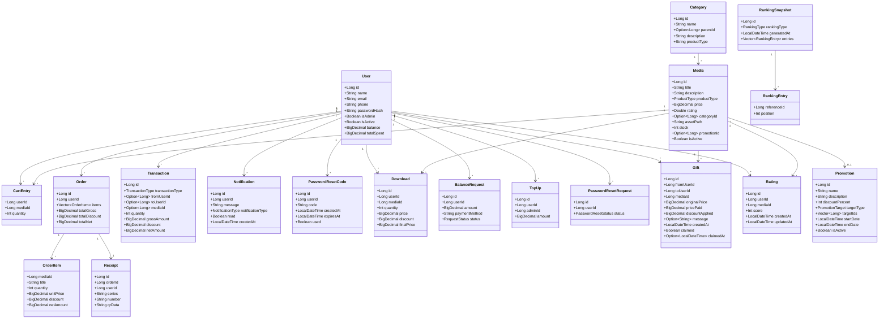

```mermaid
classDiagram
  class User {
    +Long id
    +String name
    +String email
    +String phone
    +String passwordHash
    +Boolean isAdmin
    +Boolean isActive
    +BigDecimal balance
    +BigDecimal totalSpent
  }

  class Media {
    +Long id
    +String title
    +String description
    +ProductType productType
    +BigDecimal price
    +Double rating
    +Option~Long~ categoryId
    +String assetPath
    +Int stock
    +Option~Long~ promotionId
    +Boolean isActive
  }

  class Category {
    +Long id
    +String name
    +Option~Long~ parentId
    +String description
    +String productType
  }

  class CartEntry {
    +Long userId
    +Long mediaId
    +Int quantity
  }

  class Order {
    +Long id
    +Long userId
    +Vector~OrderItem~ items
    +BigDecimal totalGross
    +BigDecimal totalDiscount
    +BigDecimal totalNet
  }

  class OrderItem {
    +Long mediaId
    +String title
    +Int quantity
    +BigDecimal unitPrice
    +BigDecimal discount
    +BigDecimal netAmount
  }

  class Transaction {
    +Long id
    +TransactionType transactionType
    +Option~Long~ fromUserId
    +Option~Long~ toUserId
    +Option~Long~ mediaId
    +Int quantity
    +BigDecimal grossAmount
    +BigDecimal discount
    +BigDecimal netAmount
  }

  class Notification {
    +Long id
    +Long userId
    +String message
    +NotificationType notificationType
    +Boolean read
    +LocalDateTime createdAt
  }

  class PasswordResetCode {
    +Long id
    +Long userId
    +String code
    +LocalDateTime createdAt
    +LocalDateTime expiresAt
    +Boolean used
  }

  class Download {
    +Long id
    +Long userId
    +Long mediaId
    +Int quantity
    +BigDecimal price
    +BigDecimal discount
    +BigDecimal finalPrice
  }

  class BalanceRequest {
    +Long id
    +Long userId
    +BigDecimal amount
    +String paymentMethod
    +RequestStatus status
  }

  class TopUp {
    +Long id
    +Long userId
    +Long adminId
    +BigDecimal amount
  }

  class Receipt {
    +Long id
    +Long orderId
    +Long userId
    +String series
    +String number
    +String qrData
  }

  class PasswordResetRequest {
    +Long id
    +Long userId
    +PasswordResetStatus status
  }

  class Gift {
    +Long id
    +Long fromUserId
    +Long toUserId
    +Long mediaId
    +BigDecimal originalPrice
    +BigDecimal pricePaid
    +BigDecimal discountApplied
    +Option~String~ message
    +LocalDateTime createdAt
    +Boolean claimed
    +Option~LocalDateTime~ claimedAt
  }

  class Rating {
    +Long id
    +Long userId
    +Long mediaId
    +Int score
    +LocalDateTime createdAt
    +LocalDateTime updatedAt
  }

  class Promotion {
    +Long id
    +String name
    +String description
    +Int discountPercent
    +PromotionTarget targetType
    +Vector~Long~ targetIds
    +LocalDateTime startDate
    +LocalDateTime endDate
    +Boolean isActive
  }

  class RankingEntry {
    +Long referenceId
    +Int position
  }

  class RankingSnapshot {
    +Long id
    +RankingType rankingType
    +LocalDateTime generatedAt
    +Vector~RankingEntry~ entries
  }

  User "1" --> "*" Order
  User "1" --> "*" Download
  User "1" --> "*" CartEntry
  User "1" --> "*" BalanceRequest
  User "1" --> "*" PasswordResetRequest
  User "1" --> "*" Transaction
  User "1" --> "*" TopUp
  User "1" --> "*" Notification
  User "1" --> "*" PasswordResetCode
  User "1" --> "*" Gift
  User "1" --> "*" Rating
  Order "1" --> "*" OrderItem
  Order "1" --> "1" Receipt
  Media "1" --> "*" Download
  Media "1" --> "*" CartEntry
  Media "*" --> "0..1" Promotion
  Media "1" --> "*" Gift
  Media "1" --> "*" Rating
  Category "1" --> "*" Media
  RankingSnapshot "1" --> "*" RankingEntry
```
